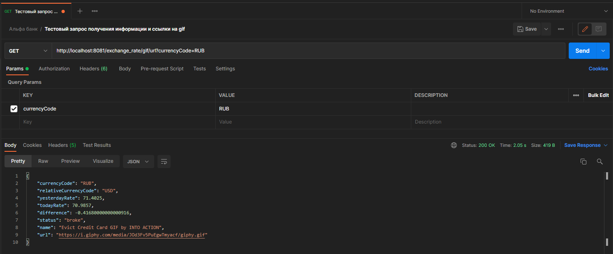
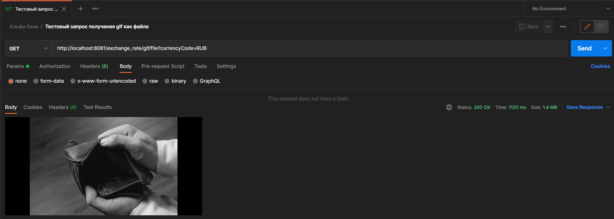

# alpha-task

Задание от Альфа-банка.

Используется Java 11.
Все конфигурируемые параметры приложения вынесены в файл свойств Spring Boot application.properties.
Параметры сборки приложения в docker-контейнер находятся в Dockerfile в корне проекта.

Инструкция по сборке и запуску приложения:
1) Открыть проект в Intellij IDEA.
2) В терминале проекта выполнить команду gradlew build
3) В терминале проекта выполнить команду docker build -t alpha:0.0.1 .
4) В терминале проекта выполнить команду docker run -d -p 8081:8080 -t alpha:0.0.1
5) После этого станет доступно обращение к API проекта в докер-контейнере по адресу localhost:8081

Инструкция по взаимодействию с API приложения:

### GET /exchange_rate/gif/url

Параметры: 
* currencyCode - код валюты, курс которой будет сопоставляться с установленной в application.properties валютой. Состоит из трех латинских букв в верхнем регистре.

Результат:
* currencyCode - присланный для сопоставления код валюты.
* relativeCurrencyCode - код валюты, относительно которой будет определяться динамика курса присланной валюты.
* yesterdayRate - предпоследний известный курс валюты.
* todayRate - последний известный курс валюты.
* difference - разница курса.
* status - характеристика динамики курса, rich или broke.
* name - название случайным образом выбранной гифки.
* url - ссылка на случайным образом выбранную гифку.

### GET /exchange_rate/gif/file

Параметры: 
* currencyCode - код валюты, курс которой будет сопоставляться с установленной в application.properties валютой.

Результат:
* Гифка, полученная случайным образом в зависимости от динамики курса валют.

 